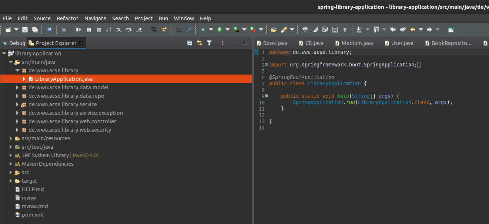
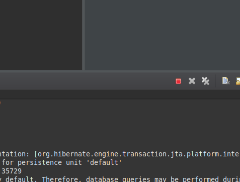

## Spring Library Application
This project comprises a simple library application. New users can register to the library and can login with their credentials.
Each user can create and edit new books. Furthermore, copies of books can be created and loaned, and books
can be deleted from the database.

The setup of the application is analogous to that of the MVC adder application and can be seen in detail [here](https://wwu-pi.github.io/tutorials/lectures/acse/030_importing_sample_projects.html#mvc).
In short: You can import the application using the Eclipse Git integration or directly use Git via the command line. Import the project as a general project.
Right-click the main folder of the imported project and select "Configure" > "Convert to Maven Project".

For developing, you might want to run the project using Eclipse. You can do this using the class annotated with the <code>@SpringBootApplication</code> annotation:

You can close the project using the console in Eclipse: 

